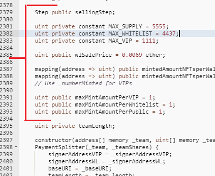
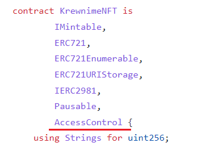
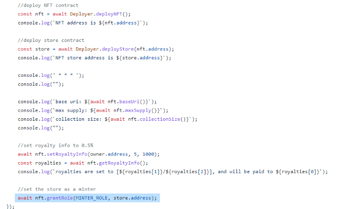

## 5 NFT Smart Contract Design Fails

The NFT boom has happened, and is still happening (as of this writing in July of 2022). Etherscan has a handy search utility which, along with its handy verification and decompiling features, lets you peek at the code of many ERC721 to compare. Along with many well-designed contracts, we can also see many make the same mistakes over and over. In this article I will give my opinions on what I think are 5 of the most common "design fails" for NFTs, that I commonly notice when viewing NFT contracts on etherscan.

Note that this article was written mainly with EVM-compatible blockchains in mind, but many of the points are applicable or have some analogy or equivalent on other networks as well.

Please don’t be insulted if you have committed some of what I call “design fails”. These are my opinions, and furthermore as a developer I fully understand the need to save on gas costs in these gas-expensive network-congested times. Consider though my point of view as a freelance consultant; a client who can spend thousands of dollars for development help can surely set out an extra hundred for deployment, in the pursuit of excellence.

This is of course speaking of the Ethereum chain, which is the most expensive as of this writing; Polygon is less so, and other chains like Solana (a non-EVM) even less so. My point is that if funds are available, the benefits of higher-quality implementation may be worth the additional cost.

### Anti-Pattern #1: Include Price/Sale Information and Logic in your Contract

This is extremely common, but when I see this, it flags the contract, to my eyes, as amateurishly done. To be fair, there are valid and understandable motivations. For one, deploying and managing contracts on many networks has become very expensive, and pains have been taken to save on those costs. And, for the sake of simplicity, one might think, why not put the minting and selling logic in with the contract itself?

But this is not really a good idea. The contract itself should be the immutable center of a network of logic, but should never dirty its own hands by handling money directly. This includes selling, sale times, whitelisting, etc., directly in the same contract code as the ERC721 implementation. The sale logic and the core logic are tightly coupled.

*typical of many NFT contracts on etherscan, this one handles sales in the ERC721*

While saving on gas costs might be the best and most understandable reason to cram all logic into one contract, I think that, all things considered, there are much better reasons to not implement this design shortcut. Your core contract logic should be the only thing set in stone, and in most cases will implement the standard in a very, well… standard manner. Many clones are (or could be) nearly clones of one another. Your minting strategy, pricing (if you’re selling mints) — these kinds of things should be decoupled. This allows your contract to be flexible in a way that doesn’t harm user trust. Decoupled design and single-responsibility principle. Side note: I think it does make sense to restrict the supply (i.e. maxSupply) in the ERC721 contract itself, as long as it can be modified by someone with an admin role.

*NFTStore is granted the MINTER role of its associated contract, so it has the responsibility of minting the NFT*

*An example of a contract being deployed in web3 code, with the “store” contract being deployed alongside it. Note that the “store” contract is assigned the minter role.*

### Anti-Pattern #2: Don’t Implement Role-Based Security

A token contract needs some sort of access control, because there are functions (like minting or doing anything to the supply parameters) which should be available only to permissioned addresses. The simplest way to accomplish this is to use an Ownable model (usually using OpenZeppelin’s Ownable contract because why reinvent the wheel for such a basic need). But I would strongly suggest using a role-based access control instead, for the following reasons. The motivation behind using Ownable (or something similar) is probably simplicity (and saving on gas costs), which is fine on the surface. You may also “know” that you (or your client) will “always” be the only one managing the contract. Future-proofing is preferable, when the cost is low; and the complexity of role-based security (e.g. OpenZeppelin’s IAccessControl) is honestly just a slight bit more complex (and expensive) when compared the Ownable model. If gas costs are still an issue, you can always prune the role-based security code (be it OpenZeppelin, or your own) to just only what you need. But the more important reason to use role-based is that it enables you to decouple functionality (as in the previous point, sale and pricing information) from the ERC721 contract itself. It allows you to designate a separate contract as the minter by assigning it the “minter” role, without allowing it full admin permissions. Whereas the admin (or admins, who are probably humans and not contracts) still have higher-level permissions (such as removing and adding permissions). When the minter (for example) no longer meets your needs, one simply retires it by revoking its minting rights, and assigning minting rights to a new contract implementing a new minting strategy; it’s modular, convenient, and secure. Other activities besides minting can be handled in the same way, based on the projects particular use cases.

Fail #3: Don't Implement ERC-165 (Introspection) Properly
Many tokens (or contracts in general) either don't implement ERC-165, or don't implement it optimally. ERC-165, in my view, is about interoperability. It makes your contract future-compatible, and exchanges may call it to find out (for example) about the royalty structure of your NFT. I see this often not implemented at all, or implemented sub-optimally. 
Here's a rule of thumb to implement it correctly:
any parent classes that implement ERC-165 should be in the override list. Then, they will be invoked when you call super.supportsInterface, automatically.
any other implemented interfaces that are not represented in parent classes, can be added with an or clause, like this: 

|| type(ISomeInterface).interfaceId == _interfaceId
example:
function supportsInterface(bytes4 _interfaceId)
        public
        view
        override(ERC721, ERC721Enumerable)
        returns (bool)
    {
        return super.supportsInterface(_interfaceId) || 
          _interfaceId == type(IERC2981).interfaceId; 
    }

If your code has no parent classes that implement ERC-165, then only the second type should be represented, such as
function supportsInterface(bytes4 _interfaceId)
        public
        view
        override
        returns (bool)
    {
        return _interfaceId == type(IERC721).interfaceId ||
            _interfaceId == type(IERC2981).interfaceId ||
            _interfaceId == type(IAccessControl).interfaceId; 
    }

If your code implements no other interfaces other than the ones handled by the parent classes' implementations of ERC-165, then the second type is not needed. Such as:
function supportsInterface(bytes4 _interfaceId)
        public
        view
        override(ERC721, ERC721Enumerable) //just make sure this list is complete
        returns (bool)
    {
        return super.supportsInterface(_interfaceId);
    }

Implementing ERC-165 correctly is optional, but important. You want your tokens to be compatible with as many other systems (such as exchanges) as possible, including future ones that haven't been implemented yet. The ERC-165 standard will likely become more used and important as time goes by and the space matures.
Fail #4: Don't Test Thoroughly Before Deploying
Your ERC721 token may be very standard, and may use all third party parent classes and libraries with very little customization, and you may know that that third party code is famously well-tested and secure. But you still need to thoroughly test your code, because you only get one chance to get it right before it's deployed to the mainnet, bringing you either glory or shame forever. 
First, of course, unit testing. What testing framework you use is not important, in my opinion; I use hardhat with ethers and mocha. To me the only important part is that the test coverage and the coverage of happy-path cases, exceptional cases, and edge cases is wide and deep. Even though you may be testing code (e.g. OpenZeppelin) that is already famously well-tested, (a) your custom code may have broken some of those cases, so they should be retested, and (b) OpenZeppelin has had bugs before, and they may again in the future. To save you some time, you may have a standard suite of tests for all ERC721 tokens, all ERC20 tokens, all ERC1155 tokens, etc. that you may reuse from project to project. This is good. Then you can add cases for each project to cover any customizations to the standard; this will save time. Unit tests should cover access control, basic functionality (like minting and transferring), pausability (if your contract is pausable), implementation of ERC165 standard, and more. You can test your coverage using solidity-coverage (a nodejs package). 
Secondly, manual testing is essential. Go over your code, looking for faults - or even better, have someone else do it. Look for a list of known and common faults - to keep this article from going too long I won't provide that list here. The lists are easy to find, and usually begin with "Reentrancy", and include things like unsafe calls to contracts, use of delegatecall, bad access control (which should have been picked up by unit tests), naming conventions, comments, and more. 
Finally, automated tools can give you a huge amount of help in testing. Slither, Manticore, and Mythril are industry standards, typically used by the major names in security auditing like Consensys and Certik. Solidity-coverage (a nodejs package) will tell you the estimated percentages of coverage your unit tests are providing (very handy as a rule of thumb). Solgraph is a tool that can help you see relationships and connections in contract code; useful in test planning. Echidna is useful too; it's a fuzzing test tool. Personally I use a test-first methodology where applicable. This ensures good test coverage, and the test suite becomes similar to a project spec. I love me some good test coverage.
> pip3 install slither-analyzer
> pip3 install mythril 
> npm install solidity-coverage
So, to summarize:
thorough, deep unit testing getting as many happy-path cases, exceptional cases, and edge cases as possible
manual testing and examination
use of automated tools like slither, manticore, mythril, echidna, and solidity-coverage

Fail #5: Don't Verify Your Contract on Etherscan
Verification of contract code on etherscan is a great feature. Seeing the green check mark on the Contract tab, and being able to see the code itself, with the "exact  match" tag, emanates trust and accountability. When someone is viewing your contract for the first time, trying to assess the relative risks of usage or investment, this can only help. And this is in general, for all contracts of all types, not just NFTs.
Contract verified on etherscanSo, when creating your NFT, keep the above in mind; your contract will be on the blockchain for as long as the blockchain exists, so make it gud. Happy coding.
